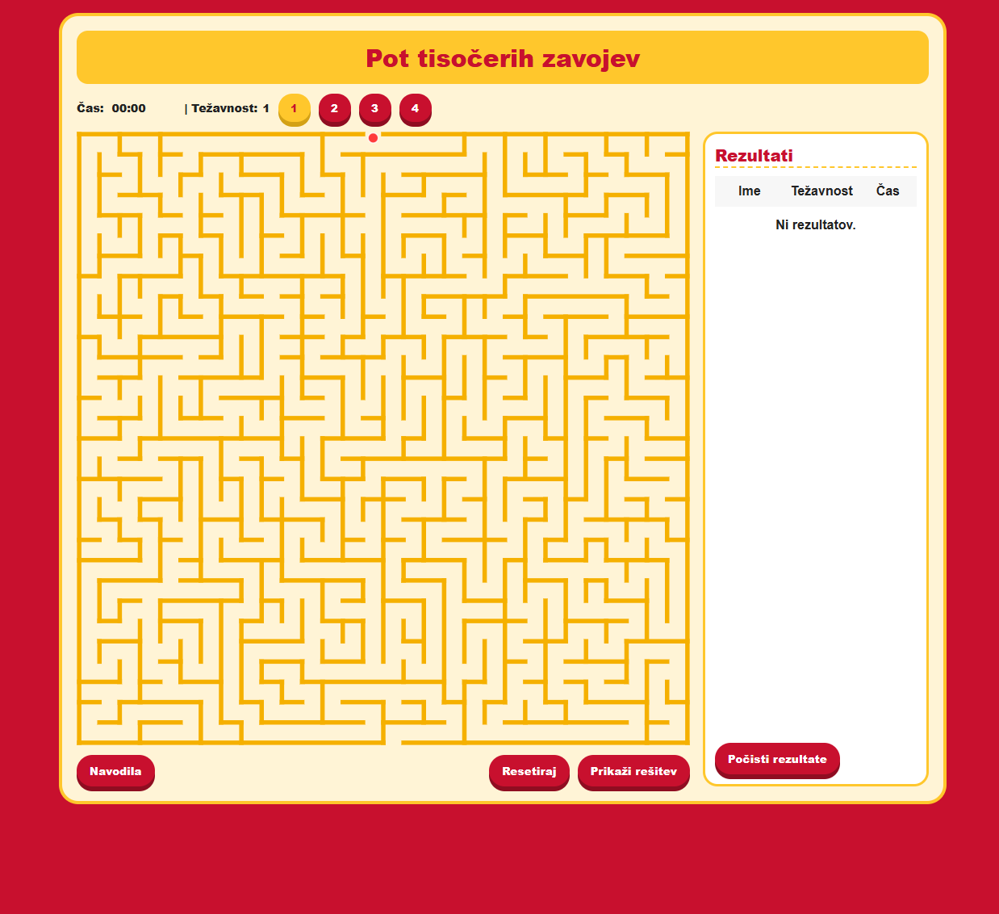
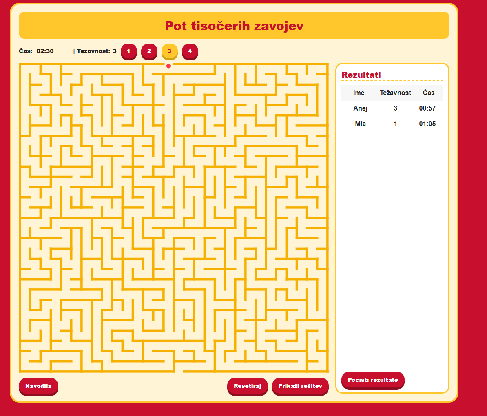

# 🧩 Pot tisočerih zavojev

Interaktivna spletna igra labirinta, kjer mora igralec najti pot skozi kompleksen  labirint. Igra vključuje več težavnostnih stopenj, časovni limit in shranjevanje rezultatov.

---

## 🎮 Demo

### 🟡 Začetek igre


### 🔴 Med igranjem


---

## 🚀 Funkcionalnosti

- 🎯 Navigacija po labirintu (WASD ali puščice)
- ⏱️ Časomer (z ali brez limita)
- 🔢 4 stopnje težavnosti
- 📊 Shranjevanje rezultatov (localStorage)
- 🧠 Prikaz rešitve (z animacijo)
- ⏸️ Pavza (SPACE)
- 🔊 Zvočni efekti zadnjih 10 sekund


---

## 🕹️ Kako igrati

- Premikanje: `W A S D` ali `↑ ↓ ← →`
- Pavza: `SPACE`
- Reset: gumb **Resetiraj** ali tipka `R`
- Cilj: priti do izhoda labirinta

---

## ⚙️ Težavnost

| Stopnja | Opis |
|--------|------|
| 1 | Brez časovne omejitve |
| 2 | 3:00 |
| 3 | 2:30 |
| 4 | 2:00 |

---

## 🧱 Tehnologije

- HTML5 (SVG labirint)  
- CSS3 (responsive + stilizacija)  
- JavaScript (game logic, collision, storage)  
- SweetAlert2 (popup okna)

---

## 📂 Struktura projekta

```
project/
│── index.html
│── css/
│   └── style.css
│── js/
│   └── script.js
│── images/
│   ├── start.png
│   └── game.png
```

---

## 💾 Rezultati

Rezultati se shranjujejo v **localStorage**:
- ime igralca
- čas
- težavnost

Max: 20 rezultatov

---

## 🧠 Posebnosti

- 🔍 Natančna detekcija trkov (circle vs line)
- 🎥 Animirana rešitev poti
- 🔊 Audio feedback pri nizkem času

---


## ✨ Namen

Projekt razvit kot interaktivna spletna igra za učenje in zabavo.
